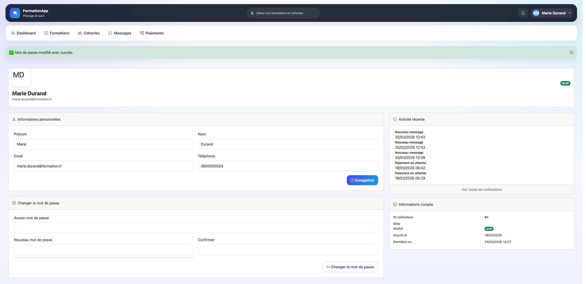

# formationapp-tests selenium

Tests automatisés pour le changement de mot de passe sur FormationApp.

### Pré-requis techniques
Python : 3.14
Selenium : 4.15.2

****SETUP****

### 1. Copier le script 

grid.py

### 2. Remplir config/grid.py

XRAY_CLIENT_ID = "votre-client-id"
XRAY_CLIENT_SECRET = "votre-secret"

### 3. Démarrer Selenium Grid

selenium-server standalone --port 4444

### 4. Lancer les tests

grid.py

C'est tout !

## 5. Tests Inclus

- CT-SG1 : Chrome - Changement MDP
- CT-SG2 : Firefox - Changement MDP
- CT-SG3 : Edge - Changement MDP
- CT-SG4 à SG10 : Validation, responsive design, etc.

## 6. Questions ?

relire SETUP 

## 7. Resultats 

- 10 tests ( CT-SG1 a CT-SG10)
- 8 PASS / 2 FAIL (CT-SG4, CT-SG10)
- Cause : saturation chrome en paralléle

## 8. Formation

Bootcamp QA - Consulting School P1-2026
